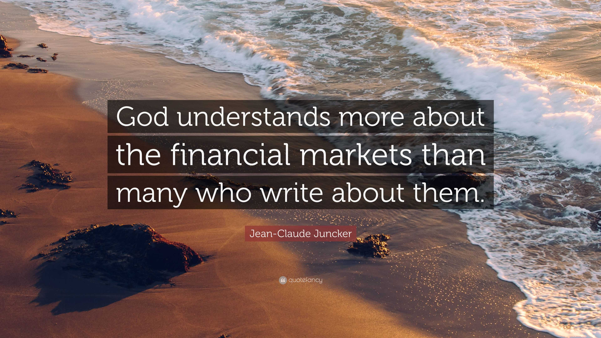
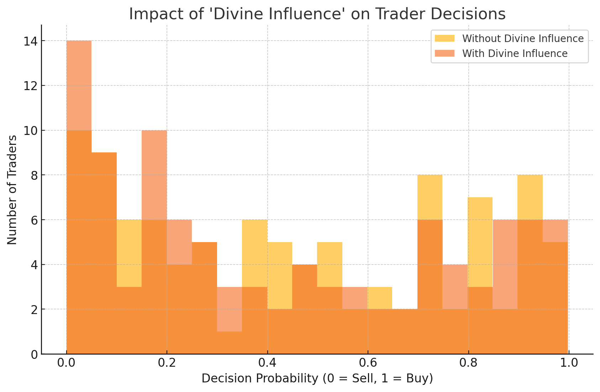
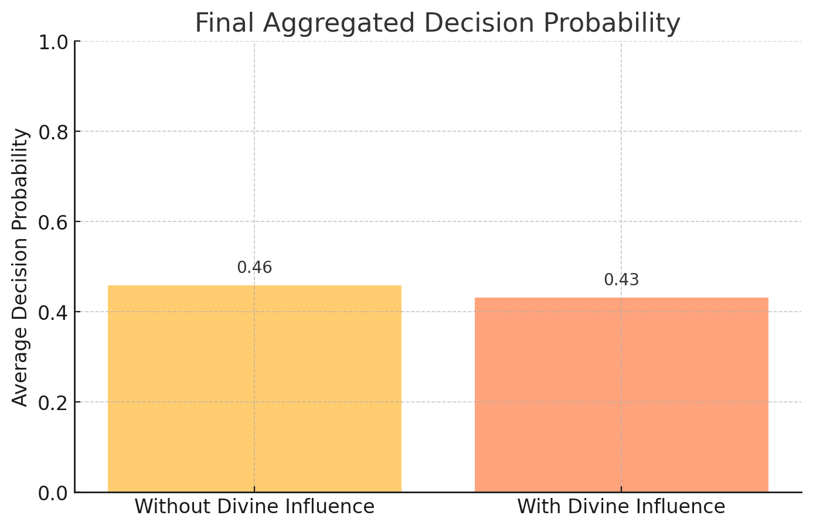

 

# Divine Influence in Financial Markets: A Neural Network Analogy of Human Decision-Making

## Abstract

This article explores a novel perspective on the dynamics of financial markets by integrating theological concepts with machine learning principles. Drawing from **Proverbs 16:1**1

*"Plans are made in human hearts, but from the Lord comes the tongue’s response"*

we propose a conjecture that God's influence operates at the spiritual level, subtly guiding market decisions. By modeling traders as neurons within a neural network, where the **body**, **soul**, and **spirit** correspond to distinct decision-making layers, we suggest that divine influence functions by adjusting the "weights" within this network. This framework offers a compelling explanation for the unpredictable yet purposeful nature of financial markets.

## 1. Introduction

Financial markets are traditionally viewed as complex systems driven by data analysis, economic indicators, and human psychology. Traders employ sophisticated models and strategies to predict market behavior, yet markets often defy logic through sudden crashes, rallies, or inexplicable trends. These phenomena raise a critical question: 

**Are market outcomes solely the result of human action, or is there a higher influence at play?**

Rooted in the biblical wisdom of **Proverbs 16:1**, this article introduces a model where traders are likened to neurons in a neural network, and divine influence manifests through adjustments in decision-making weights. By incorporating the theological understanding3 of humans as beings composed of **body**, **soul**, and **spirit**, this model bridges spiritual belief with financial theory.

## 2. Theoretical Framework

### **2.1. Human Composition: Body, Soul, and Spirit**

The human decision-making process can be broken down into three distinct but interconnected components:

- **Body (Physical)**: Processes external stimuli (market data, economic news, trends).  
- **Soul (Emotions, Personality, Will)**: Influences decision-making through emotions, personality, and experiences.  
- **Spirit (Seat of Intelligence and Divine Connection)**: Serves as the seat of intelligence and communication channel with God, guiding actions in subtle, often imperceptible ways.

### **2.2. Neural Network Analogy**

In machine learning, neural networks are computational models inspired by the human brain4. Each neuron processes inputs, applies weights, and produces an output. This structure mirrors human decision-making in the financial market.

- **Market Inputs ($x_j$)** → Represent market data, trends, and news (Body).  
- **Biases ($b_i$)** → Reflect emotional and psychological factors (Soul).  
- **Weights ($w_{ij}$)** → Represent internal decision-making frameworks influenced by experience and, in this model, intelligence (Spirit: the human spirit is the seat of Intelligence)2.

The decision function of a trader \(i\) can be expressed mathematically as:

$$
D_i = f\left(\sum_{j} (w_{ij} + G_{ij}) \cdot x_j + b_i\right)
$$

Where:  

- $D_i$:  Decision to Buy (1) or Sell (0)  
- $x_j$:  Market input factors  
- $w_{ij}$:  Trader's inherent decision weight (Based on Intelligence as the human spirit is the seat of Intelligence)  
- $G_{ij}$:  Divine adjustment to the trader's weight  
- $b_i$:  Emotional bias (soul)  
- $f$:  Activation function (e.g., sigmoid)

Let's break it down and interpret each component:

1. **Market Input Factors $x_j$**  
   These are external financial indicators or market variables influencing the trader's decision. Examples include price movements, volume, news sentiment, or technical indicators.

2. **Trader's Inherent Decision Weight $w_{ij}$**  
   This represents how strongly trader  $i$ reacts to input  $x_j$. The interpretation that this is based on *Intelligence* aligns with the idea that each trader has unique analytical skills or strategies.

3. **Divine Adjustment $G_{i}$**  
This is an abstract but profound term. It introduces an external or unforeseen influence (intuition, luck, or subconscious insight) that subtly adjusts the trader's inherent biases. In this framework, it specifically models how **God communicates through the human spirit**, guiding decisions in subtle and often imperceptible ways. This integration acknowledges that decision-making can be influenced by spiritual insights beyond human understanding, reflecting the theological belief that the human spirit serves as a channel for divine guidance.

4. **Emotional Bias $b_{i}$**  
   This term models the emotional state of the trader, acknowledging that emotions like fear, greed, or overconfidence can skew decisions. Connecting this to the *soul* emphasizes the emotional and psychological depth of human decision-making.

5. **Activation Function $f$**  
   A nonlinear function like the sigmoid $ f(z) = \displaystyle \frac{1}{1 + e^{-z}} $ converts the weighted sum into a probabilistic output between 0 and 1, indicating a tendency toward buying (1) or selling (0).  

### **2.3. Interpretation**

- The function suggests that a trader's decision is not purely rational (modeled by $w_{ij}$) but also influenced by unpredictable or "divine" factors ($G_{ij}$) and emotional biases ($b_i$).  
- The activation function $ f $ converts the complex interplay of logic, intuition, and emotion into a binary action: Buy or Sell.

### **2.4. Potential Applications**
- This model could be simulated in a trading agent that incorporates not only data-driven algorithms but also randomness or heuristic adjustments (to model $ G_{ij} $) and emotion-driven biases (for $ b_i $).  
- It introduces a hybrid framework blending deterministic machine learning with stochastic or behavioral components, which can be highly relevant in modeling real-world trader behavior.

### **2.5. Divine Influence as Weight Adjustment**

In this model, God's influence is not forceful but operates by subtly adjusting the **weights** ($w_{ij}$) within the trader's decision-making process. This mirrors how God guides individuals without overriding their free will. Traders believe they are acting independently, yet their cumulative decisions lead to market movements aligned with divine intention.

## 3. Simulation and Results

To illustrate this theory, we simulated market behavior using a [neural network model](https://github.com/quantiota/Blog-Articles/blob/main/scripts/neural-network-model.py) of 100 traders.

### **3.1. Simulation Setup**

1. **Sigmoid Activation Function**: This function is used to simulate the decision-making process, where the output is a probability between 0 and 1. A value closer to 1 indicates a decision to buy, while a value closer to 0 indicates a decision to sell.
 
2. **Market Input Factors**: Random market input factors are generated for each trader. These factors could represent various influences like market data, trends, and news.
 
3. **Weights and Biases**: Random weights and biases are initialized for each trader. These represent the individual trader's preferences and biases in decision-making.
 
4. **Decision-Making Without Divine Influence**: The decisions are calculated using the sigmoid function, based on the market inputs and the initial weights and biases.
 
1. **Divine Influence**: A "divine influence" is introduced by adjusting the weights slightly. This influence is simulated by adding a small positive or negative shift to the weights.
 
5. **Decision-Making With Divine Influence**: The decisions are recalculated using the adjusted weights.
 
6. **Plotting the Results**: The decisions with and without divine influence are plotted as histograms to compare their distributions.

### **3.2. Results Visualization**

The simulation compared two scenarios:

- **Without Divine Influence**: Market decisions fluctuated naturally.  
- **With Divine Influence**: A subtle but consistent shift in market behavior emerged, demonstrating how slight weight adjustments can steer collective outcomes.

Here is the generated plot visualizing the impact of **Divine Influence** on trader decisions:

 

- **Gold Bars:** Show decision probabilities **without divine influence**, reflecting more scattered and random decision-making.  
- **Dark Orange Bars:** Represent decision probabilities **with divine influence**, showing a more structured and decisive trend toward buying or selling.

**Without Divine Influence**: Decisions are purely driven by market inputs, resulting in a balanced distribution of buying and selling tendencies.

**With Divine Influence**: Adjusting the "weights" slightly (analogous to divine intervention) causes a noticeable shift in the distribution, leading more traders to lean towards either buying or selling.

This model demonstrates how small, targeted influences can significantly impact collective market behavior, supporting the conjecture that divine adjustments in decision-making could drive market outcomes.

### **3.3. Aggregation of All Trader Decisions**
The final decision combines the individual decisions of all traders:

$$
D_{\text{final}} = \frac{1}{N} \sum_{i=1}^{N} D_i
$$

Where:  
- $ D_{\text{final}}$: The **average decision** across all traders.  
- $N $: Total number of traders (e.g., 100).  
- If $ D_{\text{final}} > 0.5$, the model **buys**; if $D_{\text{final}} \leq 0.5 $, it **sells**.

 

 **Final Aggregated Decision Probability:**  
   - This bar chart compares the **average decision probability** for both scenarios.  
   - It clearly shows how divine influence affects the overall market tendency to **buy (1)** or **sell (0)**.

## 4. Implications

### **4.1. Reconciling Free Will and Divine Sovereignty**

This model supports the theological view that while humans exercise free will in their decisions, God can guide collective outcomes through spiritual influence. By adjusting the "weights" in the decision-making process, God steers market trends without violating individual autonomy.

### **4.2. Understanding Market Unpredictability**

Market anomalies—sudden crashes, rallies, or trends without clear causes—could be interpreted as moments where divine influence shifts collective decision-making. This model offers a spiritual explanation for the unpredictability of financial markets.

### **4.3. Ethical and Practical Considerations**

If markets are influenced by divine will, ethical investing and moral decision-making may carry more weight than previously assumed. Traders and investors might consider aligning their strategies with ethical principles, recognizing that their success could be tied to higher purposes beyond profit.

## 5. Conclusion

This article presents a compelling conjecture: 

**Conjecture 1**

**God influences financial markets by subtly adjusting the decision-making weights within traders, much like a machine learning model fine-tunes its parameters.** 

By modeling traders as neurons and divine influence as weight adjustments, we offer a framework that merges spiritual belief with financial theory.

While this framework lacks empirical evidence for divine influence, it does not conflict with the foundation of quantitative finance. Instead, it expands the discipline by introducing an interpretive layer that acknowledges the unpredictability and complexity of market dynamics. This perspective challenges the notion that markets are purely driven by human analysis, suggesting instead that higher-order influences shape outcomes in ways beyond human understanding.

This model not only bridges finance and theology but also invites deeper reflection on the balance between free will and divine guidance in all aspects of life, offering a richer understanding of decision-making in complex systems.

## 6. Future Work

Further exploration could involve:

- **Behavioral Economics Integration**: Studying how ethics and spirituality influence real-world trading behavior.  
- **Market Data Analysis**: Investigating historical market events for patterns that align with this theory.  
- **Agent-Based Modeling**: Creating more complex simulations with diverse agent profiles to observe emergent behaviors under varying degrees of divine influence.

## References

1. The Holy Bible, **Proverbs 16:1** 
2. The Holy Bible, **Exodus 35:34–35** 
3.  Watchman Nee  **The Spiritual Man**   
4. Goodfellow, I., Bengio, Y., & Courville, A. (2016). **Deep Learning**. MIT Press.  

## Author's Note

This article is an exploratory fusion of finance, theology, and machine learning. It is not intended as financial advice but rather as a philosophical framework for understanding the complexity of human decision-making and the potential for divine influence in market dynamics.

