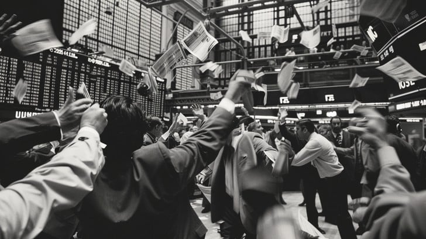

# Conjecture 2: The Absence of Divine Influence Leads to Chaos in Financial Markets

## Abstract

This article explores the second conjecture in the context of financial market dynamics: 

*Without divine influence guiding human decision-making, financial markets will evolve in a chaotic and unstable manner, driven solely by human behavior, emotion, and randomness.* 

Drawing on concepts from behavioral economics, chaos theory, and historical market behavior, this framework posits that divine influence acts as a stabilizing force in complex systems. In its absence, financial markets become highly volatile, unpredictable, and morally unanchored.

## 1. Theoretical Foundation

Financial markets are inherently complex systems where countless variables—economic data, geopolitical events, and human decisions—interact unpredictably. Without divine guidance, these systems become dominated by human flaws, resulting in instability and chaos. Contributing factors include:

- **Emotional Decision-Making:** Fear, greed, and panic drive irrational and reactionary trading decisions.
- **Cognitive Biases:** Psychological distortions like herd mentality, overconfidence, and confirmation bias lead to suboptimal decision-making.
- **Speculation and Manipulation:** Markets are susceptible to manipulation, speculative bubbles, and rumor-driven volatility.
- **Information Overload:** The deluge of data overwhelms traders, causing noise-driven decisions rather than informed strategies.

## 2. Chaos Theory and Financial Markets

Without a higher-order guiding force, markets may behave according to principles of **Chaos Theory**, where deterministic systems exhibit unpredictable behavior due to extreme sensitivity to initial conditions.

- **Nonlinear Dynamics:** Market reactions to events are disproportionate and difficult to predict.
- **High Sensitivity to Initial Conditions:** Minor factors (e.g., rumors) can cause massive market swings.
- **Fractal Patterns:** Self-similar patterns of volatility and instability repeat across different market scales.

This chaotic behavior implies that even small disruptions can trigger widespread instability in the absence of divine regulation.

## 3. Mathematical Representation

In this [framework](https://blog.quantiota.ai/page/6/divine-influence-in-financial-markets-a-neural-network-analogy-of-human-decision-making/), the absence of divine influence is mathematically expressed by setting the divine adjustment term $ G_{ij} $ to zero:

$$
D_i = f\left(\sum_{j} w_{ij} \cdot x_j + b_i\right)
$$

Where:

- **Market Inputs ($x_j$)** → Represent market data, trends, and news.  
- **Biases ($b_i$)** → Reflect emotional and psychological factors.  
- **Weights ($w_{ij}$)** → Represent internal decision-making frameworks influenced by experience and, in this model, intelligence. 
- **$f$: ** Activation function translating inputs into decisions (e.g., buy/sell).

Without the stabilizing factor $G_{ij}$ (divine influence), decision-making becomes erratic, susceptible to extreme emotional swings and market manipulation.

## 4. Implications of Chaos Without Divine Influence

- **Increased Volatility:** Market cycles of booms and busts become more frequent and severe.
- **Lack of Long-Term Stability:** Without divine alignment, markets lack cohesive, purposeful direction.
- **Market Fragmentation:** Diverse trader strategies cause disjointed, conflicting market movements.
- **Moral Decay:** Absence of higher ethical influence fosters manipulation, fraud, and unethical practices.

## 5. Supporting Evidence

Historical market collapses and crises demonstrate the consequences of unchecked human behavior:

- **Dot-Com Bubble (2000):** Speculation without fundamental grounding led to massive overvaluations and eventual collapse.
- **2008 Global Financial Crisis:** Greed-driven risk-taking and lack of ethical oversight resulted in a near-global economic collapse.
- **Flash Crashes:** Algorithmic trading without moral constraints has triggered sudden, extreme market disruptions.

These examples illustrate how markets devolve into chaos when driven purely by human emotion and greed.

## 6. Contrast with Divine Influence

$$
\begin{array}{l \quad \quad l}
\textbf{With Divine Influence (G Active)} & \textbf{Without Divine Influence (G = 0)} \\\\
\text{Subtle guidance toward market stability} & \text{Dominance of emotional, irrational behavior} \\\\
\text{Purposeful market corrections} & \text{Random, chaotic market fluctuations} \\\\
\text{Promotion of ethical trading practices} & \text{Rise of manipulation and speculative bubbles} \\\\
\text{Sustained long-term market health} & \text{Cycles of unsustainable booms and devastating crashes}
\end{array}
$$

## 7. Philosophical Reflection

This conjecture suggests that divine influence serves as a necessary stabilizing force in complex human systems. Without it, financial markets succumb to chaos, instability, and moral decay. This perspective aligns with the belief that higher-order guidance is essential for sustaining ethical and balanced systems.

## 8. Combined Model: Balancing Both Conjectures

- **Conjecture 1:** God subtly influences financial markets by adjusting traders' decision-making "weights," guiding the market toward order and sustainability.
- **Conjecture 2:** In the absence of divine influence, markets devolve into chaos, driven solely by human irrationality and systemic flaws.

By understanding both conjectures, we recognize the delicate balance between free will and divine guidance in maintaining financial stability.

## 9. Conclusion

This article proposes that without divine influence, financial markets are prone to chaos and instability. Emotional decision-making, cognitive biases, and speculation dominate, leading to frequent crises and moral decline. In contrast, divine guidance subtly stabilizes market behavior, promoting long-term growth and ethical practices. Future research could explore how probabilistic models in machine learning can simulate the impact of divine influence on financial systems, deepening our understanding of market dynamics.

